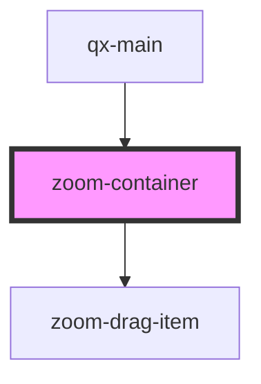

# zoom-container

<!-- Auto Generated Below -->

## Properties

| Property                | Attribute                  | Description           | Type      | Default |
| ----------------------- | -------------------------- | --------------------- | --------- | ------- |
| `height`                | `height`                   | 指定内容高度                | `number`  | `1024`  |
| `isContainerDragScroll` | `is-container-drag-scroll` | 是否只允许鼠标在容器内空白处才可拖滚动画布 | `boolean` | `true`  |
| `maxZoom`               | `max-zoom`                 | 最大缩放                  | `number`  | `3`     |
| `minZoom`               | `min-zoom`                 | 最小缩放                  | `number`  | `0.5`   |
| `width`                 | `width`                    | 指定内容宽度                | `number`  | `1440`  |

## Dependencies

### Used by

 - [qx-main](../qx-main)

### Depends on

- [zoom-drag-item](../zoom-drag-item)

### Graph

----------------------------------------------

*Built with [StencilJS](https://stenciljs.com/)*
